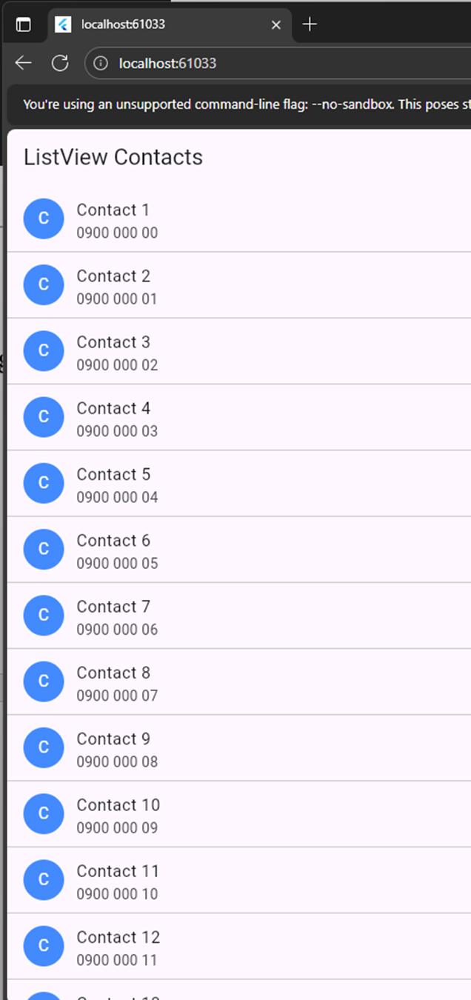
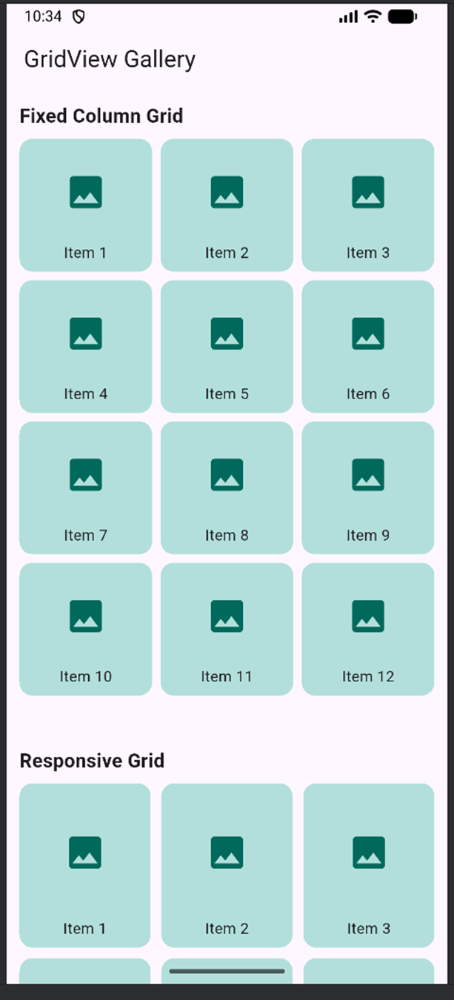
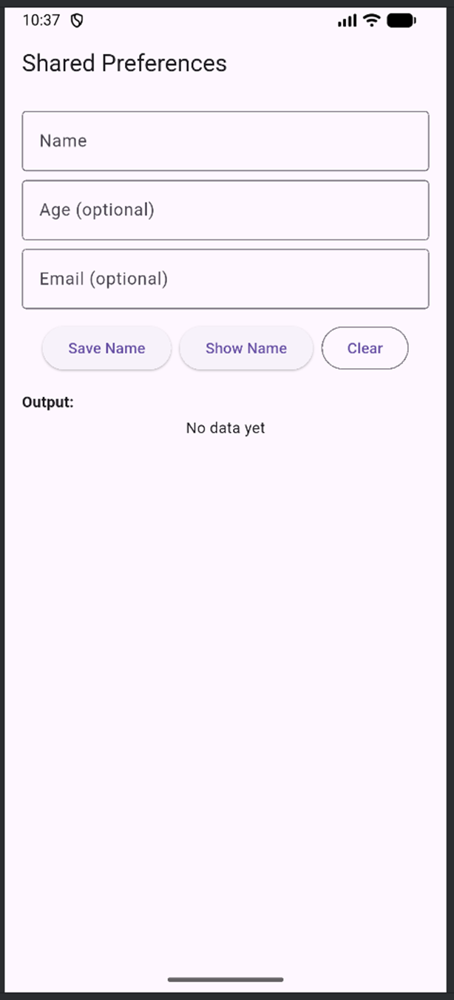
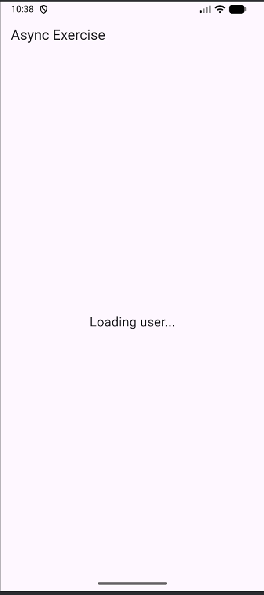
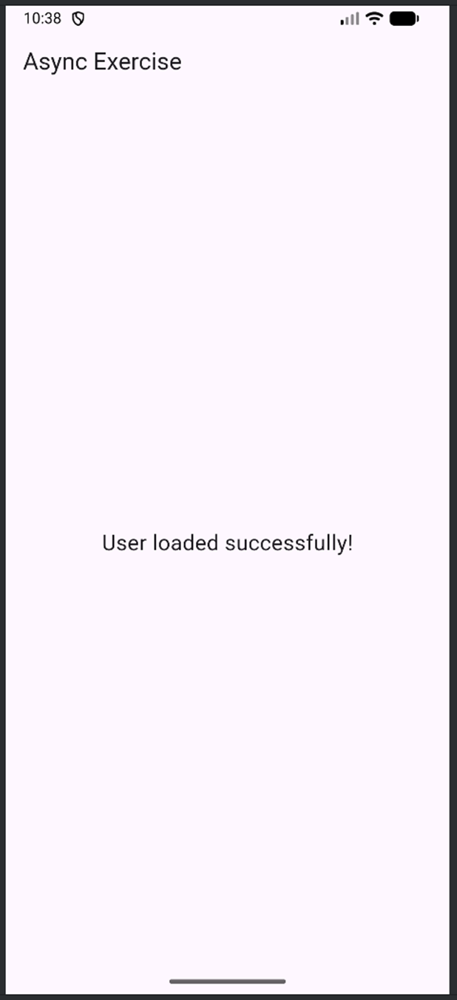
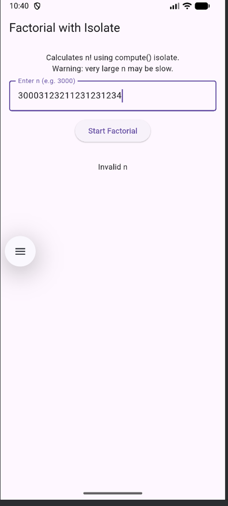

# Bài tập Tuần 4 – Flutter List/Grid, SharedPreferences, Async & Isolate

- **Sinh viên:** Lê Xuân Trường  
- **MSSV:** 2224801030263  

Repository này chứa các bài tập Tuần 4 gồm: ListView, GridView, SharedPreferences, bất đồng bộ (async) và Isolate trong Flutter/Dart.

---

## 1. List View Exercise

**Mục tiêu:**  
Xây dựng một màn hình hiển thị **danh sách liên hệ (contacts)** dạng cuộn được (scrollable).

**Yêu cầu chính:**

- Sử dụng `ListView` để hiển thị danh sách.  
- Mỗi contact phải có:
  - Avatar placeholder (có thể dùng `CircleAvatar` hoặc Image tạm).
  - Tên / thông tin liên lạc cơ bản.
- UI gọn gàng, dễ nhìn.  

**Bonus:**  
Hoàn thành bài này trong khoảng **2 giờ** (theo đề bài gợi ý).

---

## 2. Grid View Exercise

**Mục tiêu:**  
Tạo một màn hình Flutter hiển thị **gallery 12 hình ảnh hoặc icon** bằng cả **2 loại GridView**.

### 2.1. Section 1 – `GridView.count()`

- Số cột: **3**.  
- Khoảng cách giữa các hàng: **8**.  
- Khoảng cách giữa các cột: **8**.  
- Tỉ lệ khung (childAspectRatio): **1** (vuông).  
- Có tiêu đề phía trên: **"Fixed Column Grid"**.

### 2.2. Section 2 – `GridView.extent()`

- `maxCrossAxisExtent`: **150**.  
- Khoảng cách giữa các hàng: **10**.  
- Khoảng cách giữa các cột: **10**.  
- Tỉ lệ khung: **0.8**.  
- Có tiêu đề phía trên: **"Responsive Grid"**.

### 2.3. Yêu cầu cho từng item trong Grid

- Container có màu nền, bo góc (rounded corners).  
- Icon hoặc hình ảnh đặt giữa.  
- Dòng text label bên dưới (ví dụ: `"Item 1"`, `"Item 2"`, ...).

**Bonus:**  
Hoàn thành trong vòng **50 phút**.

---

## 3. Shared Preferences Exercise

**Mục tiêu:**  
Tạo một app Flutter dùng **SharedPreferences** để lưu và đọc dữ liệu đơn giản.

**Chức năng chính:**

- `TextField` để người dùng nhập **tên**.  
- Nút **“Save Name”**:
  - Lưu tên vừa nhập vào SharedPreferences.
- Nút **“Show Name”**:
  - Đọc và hiển thị lại tên đã lưu.

**Yêu cầu xử lý:**

- Khi chưa có dữ liệu, cần hiển thị thông báo phù hợp (không crash app).

**Bonus gợi ý:**

- Thêm nút **Clear** để xóa dữ liệu đã lưu.  
- Lưu thêm các trường khác như: **tuổi (age)**, **email**.  
- Lưu và hiển thị **thời gian lưu gần nhất** (timestamp).

---

## 4. Asynchronous Programming Exercise

**Mục tiêu:**  
Làm quen với lập trình bất đồng bộ trong Flutter/Dart.

**Task 1:**

- Khi mở app hoặc màn hình:
  - Hiển thị text: `"Loading user..."`.  
- Đợi **3 giây** (dùng `Future.delayed` hoặc tương đương).  
- Sau đó đổi thành: `"User loaded successfully!"`.

Có thể dùng `setState` hoặc `Provider` để cập nhật UI sau khi chờ.

---

## 5. Isolate Exercises

Làm việc với **Isolate** để xử lý các tác vụ nặng và đa luồng trong Dart.

### 5.1. Challenge 1 – Factorial với Isolate

**Mục tiêu:**

- Tạo app Flutter/Dart:
  - Tính **giai thừa** của một số rất lớn (ví dụ: `30000!`).  
  - Dùng **isolate** (hoặc `compute`) để thực hiện phép tính nặng.  
  - Trong lúc tính:
    - Hiển thị trạng thái loading/progress trên UI.
  - Sau khi tính xong:
    - Hiển thị kết quả (hoặc thông báo thành công, vì số rất lớn).

**Yêu cầu chính:**  
Không để UI bị đơ; xử lý nặng phải chạy trên isolate.

---

### 5.2. Challenge 2 – Dart Console với Isolate

Tạo một **Dart console app** với 2 isolate:

- **Background isolate (worker):**
  - Gửi các số ngẫu nhiên mỗi giây (1 số/giây) về main isolate.

- **Main isolate:**
  - Nhận các số ngẫu nhiên và **cộng dồn** tổng.  
  - Khi tổng > 100:
    - Gửi lệnh **dừng** đến worker.  
    - Worker dùng `Isolate.exit()` để kết thúc một cách gọn gàng.

---
